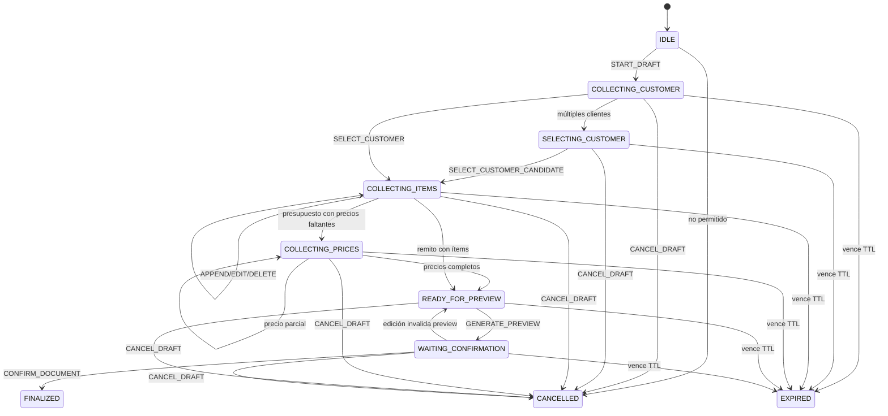

# Máquina de estados del asistente comercial

Fecha: 2026-07-23

## Objetivo

La conversación comercial se procesa mediante una transición determinista. El modelo de lenguaje no escribe en Prisma, no elige IDs, no confirma documentos y no genera nombres de archivo.

```text
mensaje
  -> normalización
  -> carga de CommercialDraft
  -> clasificación priorizada
  -> extracción estructurada
  -> resolución de cliente/referencia
  -> transición con expectedDraftVersion
  -> persistencia serializable
  -> respuesta
  -> efecto externo (preview/finalización/envío)
```

Los módulos responsables están en `src/services/commercialAssistant/`:

- `normalizer.ts`: normalización para comparar sin alterar el texto conservado.
- `actionClassifier.ts`: única prioridad de acciones comerciales.
- `parameterExtractor.ts`: contenido, precios, moneda, cantidad y nombres.
- `itemReferenceResolver.ts`: índices, ordinales, primero, último, anterior, `lineId` y texto.
- `stateMachine.ts`: validación y mutación pura.
- `draftRepository.ts`: persistencia normalizada, espejo compatible y lock optimista.
- `previewService` y `confirmationService`: se implementan como adaptadores de efectos en `orchestrator.ts`; el render existente sigue en los servicios FMH.
- `responseBuilder.ts`: resumen y mensajes.
- `orchestrator.ts`: coordina sin acceso directo a Prisma.

## Diagrama



## Invariantes

1. `draftVersion` aumenta una vez por mutación de contenido.
2. Un precio desconocido es `undefined`/`NULL`; cero sólo se admite si fue explícito.
3. `lineId` no cambia al editar descripción, cantidad o precio.
4. `previewVersion` identifica exactamente el `draftVersion` renderizado.
5. Toda mutación elimina ruta y versión del preview anterior.
6. Una referencia ambigua o inexistente no cambia el borrador.
7. `requestedFileName` está separado del nombre sugerido.
8. Un borrador activo ocupa `activeSlot = 1`; los finalizados/cancelados liberan el slot.
9. `Quote.commercialDraftId`, `DeliveryNote.commercialDraftId` y `Document.commercialDraftId` son únicos.
10. El webhook reclama un `providerMessageId` mediante inserción única antes de ejecutar efectos.

## Prioridad del clasificador

1. cancelar;
2. confirmar;
3. renombrar;
4. preview;
5. resumen;
6. cambiar cliente;
7. eliminar;
8. precio;
9. cantidad;
10. reemplazo parcial;
11. reemplazo completo;
12. agregado explícito;
13. respuesta esperada por estado;
14. consulta comercial externa;
15. contenido comercial;
16. ambiguo.

La regla evita que `resumen`, `pasame el PDF`, `guardalo`, una edición o un precio lleguen al extractor de ítems.

## Preview y confirmación

El preview no crea `Quote`, `DeliveryNote` ni `Document`. Sólo guarda el archivo temporal y registra su versión. Si el usuario edita y luego confirma, el orquestador regenera automáticamente el preview antes de finalizar.

La finalización usa el ID estable del borrador como clave de idempotencia. Un retry puede volver a renderizar un archivo, pero no puede insertar un segundo registro comercial ni un segundo `Document`.

## Concurrencia y orden

- La persistencia usa una transacción `Serializable`.
- La actualización normalizada compara `expectedDraftVersion`.
- Dos mutaciones que parten de la misma versión no pueden sobrescribirse.
- `providerMessageId` se reclama por índice único; una carrera recibe `P2002` y no se procesa otra vez.
- Se guarda el timestamp de Meta. Un mensaje anterior a la última transición completada se marca `OUT_OF_ORDER`.
- Un fallo queda como `FAILED`, conserva el borrador y puede reintentarse por el endpoint manual.
- Los errores persistidos enmascaran posibles números telefónicos.

## Compatibilidad y rollback

La migración es aditiva. `WhatsAppConversation.pendingJson` se mantiene y se actualiza en la misma transacción que `CommercialDraft`; contiene un snapshot v2 y los campos legacy. Un despliegue anterior puede seguir leyendo tipo, payload, archivo y versión.

Rollback:

1. desplegar la versión previa de la aplicación;
2. conservar las tablas/columnas nuevas (son ignoradas por el binario anterior);
3. seguir usando `pendingJson`;
4. sólo después de verificar que no se volverá a esta versión, una migración separada puede retirar tablas nuevas.

No se recomienda borrar columnas en el rollback inmediato.
